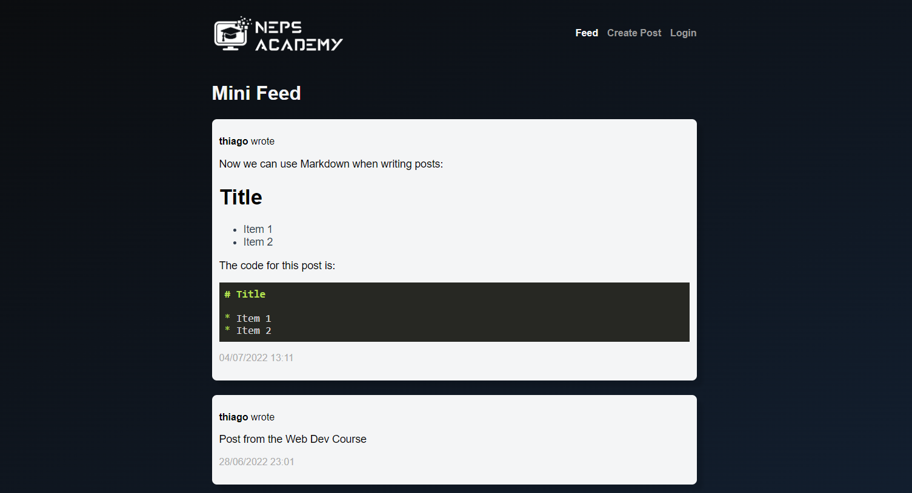

Desenvolvimento Web: Frontend

Esse projeto é parte do curso [Desenvolvimento Web: Frontend](https://neps.academy/br/course/desenvolvimento-web:-frontend) na [Neps Academy](https://neps.academy/br).

Para aprender todos os detalhes sobre a implementação desse projeto nós recomendamos participar do curso.

### MiniFeed in Vue

Esse projeto implementa o frontend da [API de um feed de notícias](https://guide-flask.herokuapp.com/docs/swagger#/) usando o framework [Vue](https://vuejs.org/).



Algumas funcionalidades incluem:

- Listar postagens de usuários;
- Login e Logout de usuários;
- Criação de novas postagens;
- Listar informações do usuário logado;
- Suport a Markdown nas postagens;
- Responsividade em dispositivos móveis;
- e mais ;)

### Setup

Para realizar o setup do projeto no seu computador computador você precisará ter o [Node e o NPM](https://nodejs.org/en/download/) instalados.

Para instalar as dependências do projeto execute execute:

```bash
npm install
```

Em seguida execute:

```bash
npm run serve
```

O projeto estará acessível na URL `http://localhost:8080`.
